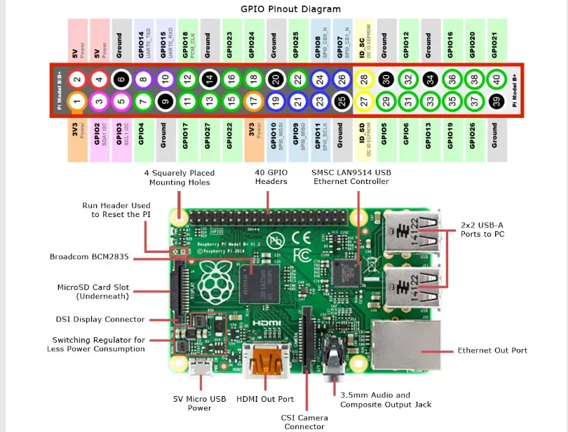

# Barman version raspberry pi

Bot as a service to make drinks

## version python

Python 3.5.3

### simule raspberry pi with conda

```bash
conda create -n barman python=3.5.3
conda activate barman
```

### Module relay



