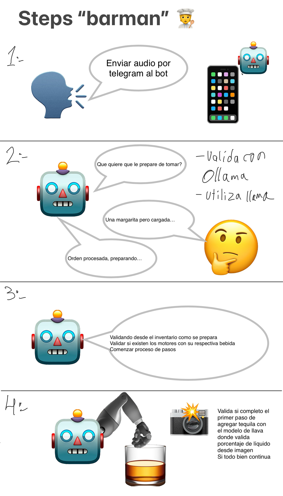
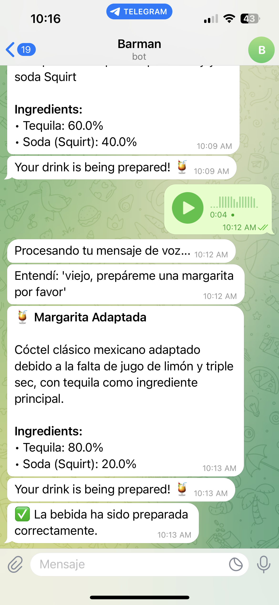

# Barman

Bot as a service to make drinks





## Posible arquitecture

```
barman/
├── raspberry-pi/            # Hardware control code
│   ├── main.py              # Main entry point
│   ├── controllers/         # Hardware controllers
│   │   ├── relay_controller.py
│   │   └── motor_controller.py
│   ├── api/                 # API client for communication
│   │   ├── client.py
│   │   └── models.py
│   └── config.py            # Configuration
│
├── server-ai/               # AI Service
│   ├── main.py              # FastAPI application
│   ├── api/                 # API endpoints
│   │   ├── routes.py
│   │   └── models.py
│   ├── agents/              # AI agents
│   │   ├── ollama_agent.py
│   │   └── llama3_agent.py
│   ├── services/            # Business services
│   │   └── drink_service.py
│   └── config.py            # Configuration
│
└── shared/                  # Shared code
    ├── models/              # Common data models
    └── utils/               # Common utilities
```

## Flujo de comunicación

1. **Usuario → Bot de Telegram**: El usuario envía un mensaje solicitando una bebida
2. **Telegram Bot → OllamaAgent**: El mensaje se procesa para generar instrucciones
3. **OllamaAgent → RaspberryPiClient**: Se envían los ingredientes con sus porcentajes
4. **RaspberryPiClient → Raspberry Pi API**: Se realiza una petición HTTP a la Raspberry
5. **Raspberry Pi → MotorController**: Se activan los motores/relés según los ingredientes
6. **MotorController → Dispositivos físicos**: Los relés activan las bombas para servir la bebida

Esta arquitectura muestra claramente la separación entre el servidor de IA (con bot de Telegram e inteligencia artificial) y la Raspberry Pi (que controla el hardware), con comunicación vía HTTP.

## how works the bot?

**steps**

1. call his name (barman)

    1.1. barman ask for the drink (what do you want to drink?)

    1.2. user say the drink (margarita please)

    1.3. barman ask for the size (what size do you want?)

    1.4. user say the size (medium)

2. prepare the drink

    2.1. barman check motor one where is the tequila

    2.2. barman check motor two where is the soda "squirt"

    2.3. barman check motor three where is the lemon

3. serve the drink

    3.1. barman serve the drink in a glass

    3.2 barman with camera check the glass if is empty or not

    3.3 barman serve the drink

    3.3. barman check the glass if is full

    3.4. repeat the process with other motors

4. finish the drink

### install pyaudio on mac

```bash
pip install SpeechRecognition
pip install PyAudio
brew install portaudio
pip install PyAudio --global-option="build_ext" --global-option="-I/opt/homebrew/include" --global-option="-L/opt/homebrew/lib"
```

## TODO List

### server-ai

- [ ] Add endpoints to the API (server-ai)
  - [ ] POST /drinks where send text request and return steps to prepare the drink with the motors time to run

### raspberry-pi

- [ ] Add endpoints to the API (raspberry-pi)
  - [ ] POST /drinks where send steps to prepare the drink with the motors time to run
