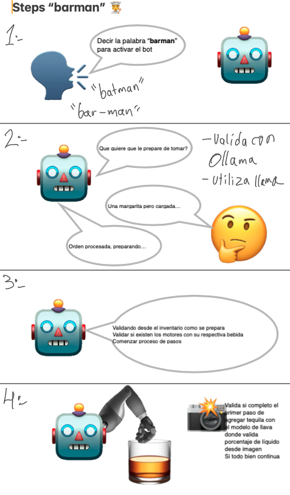

# Barman

Bot as a service to make drinks



## Posible arquitecture

```
barman/
├── raspberry-pi/            # Código para el control de hardware
│   ├── main.py              # Punto de entrada principal
│   ├── controllers/         # Controladores de hardware
│   │   ├── relay_controller.py
│   │   └── motor_controller.py
│   ├── api/                 # Cliente API para comunicación
│   │   ├── client.py
│   │   └── models.py
│   └── config.py            # Configuración
│
├── server-ia/                # Servicio de IA
│   ├── main.py              # Aplicación FastAPI
│   ├── api/                 # Endpoints de la API
│   │   ├── routes.py
│   │   └── models.py
│   ├── agents/              # Agentes de IA
│   │   ├── ollama_agent.py
│   │   └── llama3_agent.py
│   ├── services/            # Servicios de negocio
│   │   └── drink_service.py
│   └── config.py            # Configuración
│
└── shared/                  # Código compartido
    ├── models/              # Modelos de datos comunes
    └── utils/               # Utilidades comunes
```

## how works the bot?

**steps**

1. call his name (barman)

    1.1. barman ask for the drink (what do you want to drink?)

    1.2. user say the drink (margarita please)

    1.3. barman ask for the size (what size do you want?)

    1.4. user say the size (medium)

2. prepare the drink

    2.1. barman check motor one where is the tequila

    2.2. barman check motor two where is the soda "squirt"

    2.3. barman check motor three where is the lemon

3. serve the drink

    3.1. barman serve the drink in a glass

    3.2 barman with camera check the glass if is empty or not

    3.3 barman serve the drink

    3.3. barman check the glass if is full

    3.4. repeat the process with other motors

4. finish the drink

### install pyaudio on mac

```bash
pip install SpeechRecognition
pip install PyAudio
brew install portaudio
pip install PyAudio --global-option="build_ext" --global-option="-I/opt/homebrew/include" --global-option="-L/opt/homebrew/lib"
```
